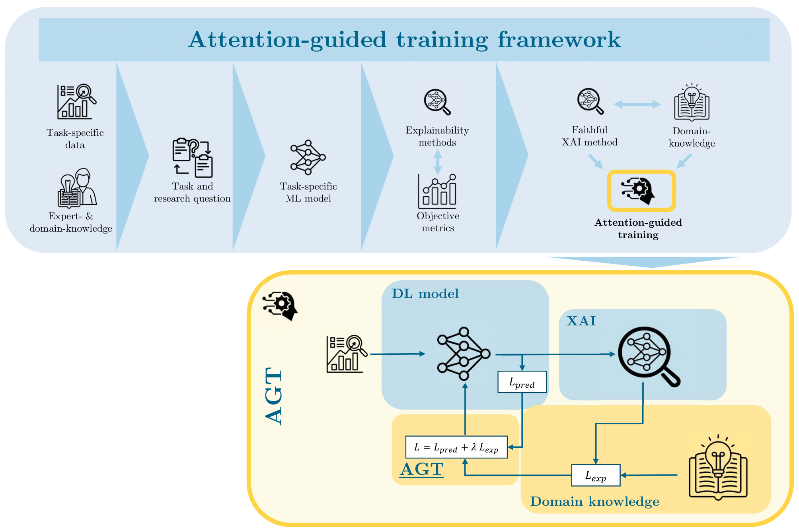

<h1 style="text-align: center;">Attention-Guided Training</h1>

[](https://doi.org/10.5281/zenodo.16902960)

## Description
Ensuring the trustworthiness and robustness of deep learning models remains a fundamental challenge, particularly in high-stakes scientific applications. This repository presents a framework called **attention-guided training (AGT)**  that combines explainable artificial intelligence techniques with quantitative evaluation and domain-specific priors to guide model attention.

This repository demonstrates how domain specific feedback on model explanations during training can enhance the model’s generalization capabilities. In particular we validate the approach on the task of semantic crack tip segmentation in digital image correlation data which is a key application in the fracture mechanical characterization of materials. By aligning model attention with physically meaningful stress fields, such as those described by Williams’ analytical solution, attention-guided training ensures that the model focuses on physically relevant regions. This finally leads to improved generalization and more faithful explanations.

<p align="center">
  
</p>

More details on this work can be found in the corresponding publication <a href="https://arxiv.org/abs/2507.20658" style="color: blue; text-decoration: underline;">here</a>.

## Citing this work
If you find the ideas presented here compelling, please consider citing our publication:

```Plain Text
Talies, J., Breitbarth, E., & Melching, D. (2025). 
Towards Trustworthy AI in Materials Mechanics through Domain-Guided Attention. 
arXiv preprint arXiv:2507.*
```

```bibtex
@misc{talies2025agt,
  author       = {Jesco Talies and Eric Breitbarth and David Melching},
  title        = {Towards Trustworthy AI in Materials Mechanics through Domain-Guided Attention},
  year         = {2025},
  archivePrefix = {arXiv},
  eprint       = {***},
  primaryClass = {cs.LG},
  note         = {Preprint, under review},
  url          = {https://arxiv.org/abs/***}
}
```

---

## Prerequisites
This project was developed and tested using [](https://www.python.org/).

**Imports**
```bash
pip install crackpy==1.2.3 
```
or
```bash
pip install -r requirements.txt
```

**Data**
The data will be downloaded automatically by the `DataSetup` class.
If you want to avoid this behaviour, you can manually download the required data from the Zenodo repository [](https://doi.org/10.5281/zenodo.5740216).
Place the unzipped resources into a `data/` folder, such that you have the resulting structure:
```
data/
├S_160_4.7/
├S_160_2.0/
├S_950_1.6/
```


## Usage

**Getting to know the framework:**

The separate components involved in the presented AGT training workflow are presented by individual scripts in `scripts/`.
These scripts introduce the user to the different steps and components and how they may be reused and configured individually.
An execution command and short description for each is given below:

**`python scripts/1_data_import.py`**

Shows how to import the datasets and how to vary data augmentation, target explanations, etc.

**`python scripts/2_conventional_training.py`**

Performs a conventional deep learning training run as a known reference.

**`python scripts/3_attention_guided_training.py`**

Performs an attention guided training.

**`python scripts/4_model_benchmarking.py`**

Evaluates a given model's performance based on the Dice coefficient for datasets with defined targets and a custom reliability criterion.
Note: Requires model weights generated by script 2 or 3.

**`python scripts/5_model_explanation.py`**

Generates a representative explanation for a given model.
Note: Requires model weights generated by script 2 or 3.

**`python scripts/6_explanation_evaluation.py`**

Evaluates the quality of the explanation based on a subset of the Co12 criteria presented by Nauta et al..
Note: Requires model weights generated by script 2 or 3. Does not require running script 5.


**Parameter study and evaluation**

To reproduce the runs presented in the publication we compiled the necessary steps to train and evaluate models into the scripts:

**`python 1_training_orchestrator.py`**

**`python 2_evaluate_performance.py`**

**`python 3_evaluate_correctness.py`**

which represent a combination of the `scripts/` components.
Make sure to run theese in order, as each script requires data from previous steps.

Feel free to vary the parameters and explore how each influences the training and resulting model performance.
Due to the large hyperparameter space we cannot provide a full coverage of possible parameter combinations. The presented results are based on cumulative experience obtained in preliminary experiments, parameter studies, intuition and empirical decisions.

## Authors and acknowledgment
**Acknowledgments for contributions go out to**:
- **Jesco Talies** — [jesco.talies@dlr.de](mailto:jesco.talies@dlr.de) | [](https://orcid.org/0009-0000-0786-7908) 
for conceptualization and implementation.
- **David Melching** — [david.melching@dlr.de](mailto:david.melching@dlr.de) | [](https://orcid.org/0000-0001-5111-6511) 
for conceptualization, project supervision, and feedback.
- **Eric Breitbarth** — [eric.breitbarth@dlr.de](mailto:eric.breitbarth@dlr.de) | [](https://orcid.org/0000-0002-3479-9143) 
for his domain expertise, discussions, and feedback.


## Project status, future support, and roadmap
As this repository is the result of a completed master's thesis, active development has concluded. However, contributions or reuse are welcome — feel free to contact us for discussions or licensing via [David Melching](mailto:david.melching@dlr.de).


## License
The package is developed for research and educational purposes only and must not be used for any production or specification purposes. We do not guarantee in any form for its flawless implementation and execution. However, if you run into errors in the code or find any bugs, feel free to contact us.

The code is licensed under MIT License (see LICENSE file). The datasets are licensed under Creative Commons Attribution 4.0 International License (CC BY 4.0).
